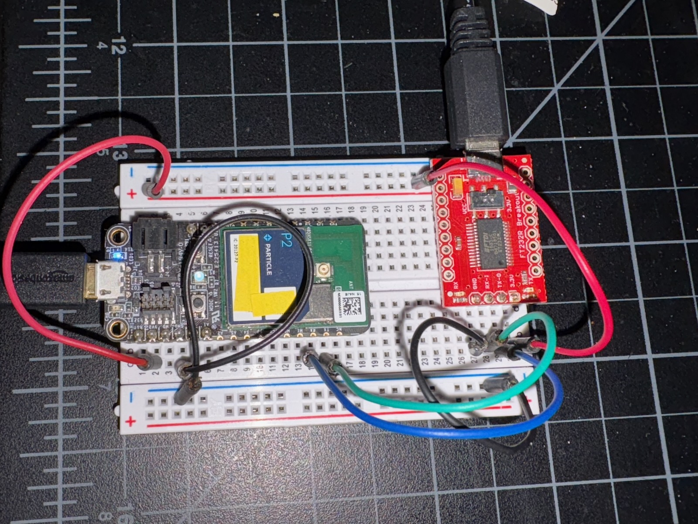

# SerialTest2

*Test code for UART serial for Photon 2, P2, and M-SoM*

This code was to test the UART serial receiving data on the Photon 2 to make sure it operates correctly at 230400 baud.



It operates by using a FT232 USB to serial adapter along with a node.js program to send data by serial.

You must increase the serial buffer to 512 bytes for it to work properly.

Also note: If you are using Device OS 6.3.0 or earlier, and you hit an error condition that causes the lost packet error to appear, you will likely get into a cascade of errors which cause it to never work again. This is caused by slow USB serial logging in those Device OS versions.

By using Device OS develop, which will be in 6.3.1, any lost data is only one packet long and recovers immediately:

```
0000510639 [app] INFO: good=828474 bad=850 pct=99 kbytesRcvd=6627.0 13722 bytes/sec
0000516474 [app] INFO: wrong sequence, expected 000ce4f3 got 2a2a2af3
0000520639 [app] INFO: good=845565 bad=855 pct=99 kbytesRcvd=6764.0 13721 bytes/sec
0000530639 [app] INFO: good=862725 bad=855 pct=99 kbytesRcvd=6901.0 13721 bytes/sec
0000540639 [app] INFO: good=879880 bad=855 pct=99 kbytesRcvd=7039.0 13721 bytes/sec
0000550639 [app] INFO: good=897161 bad=855 pct=99 kbytesRcvd=7177.0 13723 bytes/sec
0000560639 [app] INFO: good=914433 bad=855 pct=99 kbytesRcvd=7315.0 13725 bytes/sec
0000564672 [app] INFO: wrong sequence, expected 000e288a got 000e288b
0000570639 [app] INFO: good=931445 bad=859 pct=99 kbytesRcvd=7451.0 13722 bytes/sec
0000575724 [app] INFO: wrong sequence, expected 000e7208 got 000e7209
0000580640 [app] INFO: good=948730 bad=863 pct=99 kbytesRcvd=7589.0 13724 bytes/sec
0000590640 [app] INFO: good=966075 bad=863 pct=99 kbytesRcvd=7728.0 13727 bytes/sec
0000600640 [app] INFO: good=983187 bad=863 pct=99 kbytesRcvd=7865.0 13726 bytes/sec
0000610640 [app] INFO: good=1000161 bad=863 pct=99 kbytesRcvd=8001.0 13724 bytes/sec
```


